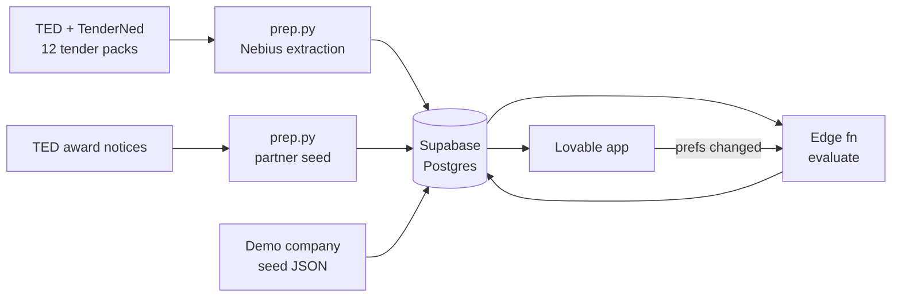

# Procurement Passport — Hackathon Technical Design

Sep 23, 2026

## Summary

In 3 hours we build the gap engine and partner layer for one demo company against 12 curated open Dutch IT tenders. Everything else in the proposal is shown as roadmap.

The demo answers one question: which open tenders could this company still bid on, what blocks each one, and who could fill the gap. LLMs only read documents, and all verdicts come from deterministic code. Tender extraction and partner data are prepared offline and cached, so the live demo never waits on a model.

## Scope

We build proposal layers 3 to 5 at demo depth and fake layers 1 and 2 with seed data.

| Proposal layer | In the 3h build | How |
| --- | --- | --- |
| 1. Passport | Seeded | One demo company as JSON, shown on a confirm screen. Doc upload is a stretch goal. |
| 2. Tender matching | Seeded | 12 hand-picked open NL tenders (IT, software, cyber, CPV 72/48), all treated as relevant |
| 3. Gap engine | Built | Requirements extracted offline, checked by code with source clause |
| 4. Gap ladder + remedies | Built | Level 1–6 per gap, deadline check, tender labels, aggregate gap view, 3 preference toggles |
| 5. Partners | Built, simple | ~30 candidates from TED award data plus hand-entered certificates, ranked and joint-checked |
| EV fix-vs-partner | Cut | Roadmap slide |
| Nota van Inlichtingen re-runs | Cut | Roadmap slide |
| KvK, IAF CertSearch, website crawl | Cut | Partner facts hand-entered and labelled by trust level |

Only 6 requirement types are checked in code: turnover, certification, references, insurance, staff/language, and local presence. Anything else becomes a needs-review item.

## Architecture

Three parts: an offline Python prep script, a Supabase backend with one evaluation function, and a Lovable frontend that only reads results.



The LLM runs only inside `prep.py`, before the demo. `evaluate` is plain TypeScript and runs in milliseconds, so preference toggles re-run it live.

| Component | Tech | Owner |
| --- | --- | --- |
| Tender + partner prep | Python, `requests`, `pdfplumber`, OpenAI-compatible client pointed at Nebius Token Factory | Person A |
| Extraction model | DeepSeek-V4-Flash or GLM-5.3-Flash; escalate to a larger model per clause if JSON fails validation (check names and prices in the console) | Person A |
| Database | Supabase Postgres, seed via SQL | Person B |
| Rules engine | Supabase Edge Function `evaluate` (Deno, TS) | Person B |
| Frontend | Lovable, connected to our own Supabase project | Person C |

## Data model

Eight tables. Requirements and capabilities share the same `req_type` and `key` vocabulary, so matching is a join plus a comparison.

| Table | Key fields | Purpose |
| --- | --- | --- |
| `companies` | id, name, is_demo, prefs jsonb | Demo company and partner candidates in one table |
| `capabilities` | company_id, req_type, key, value_num, value_text, valid_until, trust (verified / official / claim), source_url, source_quote | What a company can prove: `turnover_avg3y`, `iso_27001`, `liability_insurance_eur`, `lang_nl`, `office_nl`, `fte` |
| `references` | company_id, buyer, public_sector, cpv, value_eur, end_date, trust, source_url | Past projects; for partners these come from TED award notices |
| `tenders` | id, ted_id, title, buyer, value_eur, deadline, joint_bids_allowed, subcontracting_allowed, source_url | 12 curated open tenders |
| `requirements` | tender_id, req_type, key, operator, threshold_num, threshold_text, window_years, public_sector_required, knockout, lot, clause_ref, source_quote, page, confidence | One row per extracted requirement |
| `results` | company_id, requirement_id, status (pass / gap / review), gap_level, fixable_in_time, reason | Output of `evaluate` for the demo company |
| `tender_status` | company_id, tender_id, label, met, total, gaps jsonb | One row per tender with its label |
| `partner_recs` | tender_id, partner_id, rank, score, gaps_covered, joint_met, joint_total, role, evidence jsonb | Ranked partner shortlist per tender |

A static `ladder` table holds level, label, typical time range text and `max_days` (1: 7, 2: 21, 3: 60, 4: 150, 5 and 6: null).

## Pipelines

All data is prepared by `prep.py` and written straight into Postgres. If extraction is weak, a person corrects the rows by hand; demo correctness beats automation.

**1. Tender extraction (per tender)**

1. Download the notice from TED and the document pack from TenderNed into `data/tenders/<id>/`.
2. Extract text with `pdfplumber`. Keep only pages that match selection keywords: *geschiktheidseisen*, *uitsluitingsgronden*, *minimumeisen*, *referentie*, *omzet*, *certificaat*, *verzekering*, *combinatie*, *onderaanneming*.
3. Send those pages to the extraction model with a fixed JSON schema matching `requirements`. Require `source_quote` and `page` on every row.
4. Validate with Pydantic. On failure, retry once with the larger model.
5. Also extract `joint_bids_allowed` and `subcontracting_allowed` for the `tenders` row.
6. Spot-check every tender by hand (about 3 minutes each).

**Fallback:** if the pack is missing or scanned, extract from the TED notice text only and mark `confidence = low`.

**2. Partner seed**

1. Query TED for NL award notices from the last 3 years in the same CPV codes.
2. Group winners by name, keep about 30 with 2+ public-sector awards, and insert them into `companies` and `references` with `trust = official`.
3. For the 8–10 partners you expect to recommend, hand-enter certificates, offices and languages from their websites with `trust = claim` and the source URL.

**3. Demo company**

One SQL seed file with a profile built to produce a clean demo: turnover €1.4M, ISO 9001 only, two public references, €1M liability insurance, office in Amsterdam, Dutch speaking. Tune the values after the first `evaluate` run so the gaps spread across the ladder.

## Gap engine

`evaluate(company_id)` checks every knock-out requirement, puts each gap on the ladder, labels every tender, and writes the aggregate. It never calls an LLM.

**Rules per requirement type**

| req_type | Pass when | Gap level if failed |
| --- | --- | --- |
| certification | Capability with same key exists and `valid_until >= deadline` | 4 (or 1 if held but no document uploaded) |
| insurance | `value_num >= threshold` | 2 |
| staff_language | Capability key present (e.g. `lang_de`, `pm_prince2`) | 3 |
| turnover | `turnover_avg3y >= threshold` | 5 |
| references | Count of references with `end_date` in window, `value >= min`, public sector if required, is `>= threshold` | 5 |
| local_presence | Office key present in required country or region | 5 |
| other or "comparable" wording | Never auto-pass | review (shown, not counted as a gap) |

Any level-5 gap on a tender where `joint_bids_allowed` and `subcontracting_allowed` are both false becomes level 6. So does any failed exclusion ground.

**Deadline check**

`fixable_in_time = ladder.max_days <= days_until(deadline) - 5`, with a 5-day margin for bid writing. Levels 5 and 6 are never fixable alone.

**Tender label** (first match wins)

1. **Out of reach:** any level-6 gap.
2. **Ready:** no gaps.
3. **Reachable: fix it:** every gap fixable in time and allowed by preferences.
4. **Reachable: partner:** remaining gaps covered by a partner with `joint_met = total` (see Partner recommendations) and partners allowed by preferences.
5. **Future:** everything else.

**Preferences** (three toggles on `companies.prefs`)

- Allow certification: yes/no
- Allow partners: yes/no
- Partner minimum contract value: € amount

**Aggregate gap view** (SQL view `gap_summary`)

Per gap key: open tenders blocked, total value blocked, and tenders unlocked if this gap alone is closed. The last counts only tenders where this is the only gap, so the headline number never overclaims.

## Partner recommendations

For each tender with gaps left after the company's own in-time fixes, `evaluate` merges the company profile with each candidate and re-runs the same rules. That merged run is the joint check, so "you + Company B: 19 of 19" is computed, not claimed.

**Steps**

1. Input: the tender's remaining gaps and its `joint_bids_allowed` and `subcontracting_allowed` flags.
2. Candidates: every seeded partner that covers at least one remaining gap, excluding the demo company's `excluded_partners` list.
3. Joint check: combine capabilities and references (turnover summed only if `joint_bids_allowed`), then re-run the rules to get `joint_met` of `joint_total`.
4. Score and keep the top 3.
5. Role: references or turnover covered → capacity provider or consortium partner; certification, staff or presence covered → subcontractor for that part of the work.

**Score**

```
score = 0.5 × coverage + 0.25 × evidence + 0.15 × relevance + 0.10 × size_fit
```

- coverage: share of remaining gaps this partner closes.
- evidence: 1.0 for official award data, 0.5 for website claims, averaged over the facts used.
- relevance: 1.0 if the partner has an award with the same CPV division and buyer type, else 0.5.
- size_fit: 1.0 if the partner's largest award is 0.5–3× the tender value, else 0.5.

Each recommendation stores its evidence as a list of fact, trust level and source URL, so the UI can show why.

## API and screens

One edge function does the work; the frontend reads tables through the Supabase client.

| Endpoint | Input | Does |
| --- | --- | --- |
| `POST /evaluate` | company_id | Recomputes `results`, `tender_status`, `partner_recs` for that company. Called on load and on every preference change. |
| `PATCH companies.prefs` | prefs jsonb | Direct Supabase update from the UI, then call `/evaluate` |
| `gap_summary` view | company_id | Read-only aggregate for the dashboard |

**Screens (Lovable)**

| Screen | Shows | Demo step |
| --- | --- | --- |
| Profile | Company capabilities with trust badges, confirm button, 3 preference toggles | 1 |
| Reachable tenders | Headline "N tenders worth €X within reach", list with label chip, met/total, deadline | 2 |
| Tender detail | Requirement table: status, gap level chip, fixable-in-time, clause quote and page on click | 3 |
| Gap value | `gap_summary` ranked by value unlocked alone, bar chart plus table | 4 |
| Partner case | "You alone: X of Y" vs "You + partner: Y of Y", top 3 partners with score, role and evidence list | 5 |

Tell Lovable to use the existing Supabase tables and never to create its own schema. Keep all logic in `/evaluate`.

## 3-hour build plan

The plan assumes three people and that tender curation (picking the 12 tenders and downloading packs) happens before the clock starts. If it can't, cut to 8 tenders and extract from TED notice text only.

| Time | Person A: data | Person B: backend | Person C: frontend |
| --- | --- | --- | --- |
| 0:00–0:20 | Nebius key, smoke-test the extraction model | Supabase project, schema SQL, `ladder` seed | Lovable project linked to Supabase, 5 empty screens |
| 0:20–1:10 | Extract requirements for 12 tenders, spot-check, load | Demo company seed; `/evaluate` rules and ladder | Screens on mock JSON shaped like the tables |
| 1:10–1:50 | Partner seed from TED awards, hand-enter 8–10 partner facts | Labels, deadline check, `gap_summary`, partner joint check and score | Wire screens to real tables |
| 1:50–2:30 | Tune demo company values for a clean story | Preferences and re-run; fix edge cases | Gap chart, partner comparison, trust badges |
| 2:30–3:00 | Freeze data | Freeze code | Two full demo run-throughs |

With two people, B also takes A's work after 1:10 and C builds screens only on real data from 1:10.

## Demo script, risks and fallbacks

The demo runs in 3 minutes on cached data, following the proposal's five steps.

1. Profile: "This is a real-shaped Dutch IT SME." Show trust badges.
2. Reachable tenders: "7 tenders worth €X are within reach."
3. Tender detail: 17 of 19 met, 2 gaps, each with ladder level, deadline check and the quoted clause.
4. Gap value: "ISO 27001 alone unlocks 4 tenders worth €Y."
5. Partner case: "You alone: not eligible. You + Company B: 19 of 19," with award-data evidence. Then flip "Allow partners" off live and watch the list re-sort.

| Risk | Fallback |
| --- | --- |
| Extraction on Dutch packs is poor | Hand-correct rows; mark `confidence = low`; demo only verified tenders |
| TED contract values missing | Show tender count first, € only where known |
| Too few partners cover the gaps | Pick demo tenders where at least one seeded partner has matching CPV awards |
| Lovable rewrites the schema | Lock schema in SQL, give Lovable table names explicitly |
| Judge asks "is this Altura?" | "They check one tender; we show which tenders you're locked out of and who gets you in." |

The main metric to mention is the false-eligible rate: the engine never says pass on a judgment item, only review.
